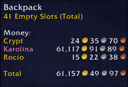
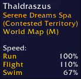

# WowInfo

WowInfo is a World of Warcraft addon that provides game and character information:

To open the options you can type `/wi`, `/wowi` or `/wowinfo`.

## Currency Tab

When hovering over a currency token in the `Currency Tab`, it should show the amount for characters that has it available.

## Character Info

When hovering over the `Character Info` button, it should show the following information:

* The currency for the current expansion.
* The progress of the great vault.
* The durability of equipped items as well as bags.
* The reputation status for tracked factions, you can choose what factions to track in the options.

## Achievements

When hovering over the `Achievements` button, it should show a summary of the player and guild achievements.

## Quest Log Tooltip

When hovering over the `Quest Log` button, it should show a summary of completed, incompleted and total quests, the campaign and zone story progress.

## Guild & Communities Tooltip

When hovering over the `Guild & Communities` button, it should show your guild friends when they are online.

## Group Finder Tooltip

When hovering over the `Group Finder` button, it should show the following information:

* The progress of saved dungeons and raids.
* The progress of honor level, conquest bar and the current arena/rbg rating.

## Collections Tooltip

When hovering over the `Collections` button, it should show total mounts, pets and toys as well as their collect achievements progress respectively.

## Adventure's Guide Tooltip

When hovering over the `Adventure's Guide` button, it should show a summary of the traveler's log progress and reward for the current month.

## Game Menu Tooltip

When hovering over the `Game Menu` button, it should show the connected realms you are connected to, if any.

## Backpack Tooltip

When hovering over the `Backpack` bag, it should show the money for all characters.

## Clock Tooltip

When hovering over the `Clock`, it should show the reset time for the daily quests.

## Status Bar Tooltip

When hovering over the `Status Bar` / `Experience Bar`, it should show extended information regarding the experience progress of the current character.

## Social Tooltip

When hovering over `Social`, it should show your friends status when they are online, afk or dnd.

## Minimap

Shows the player's speed and status on the `Minimap`s zone text when the character moves.

# Side Notes

* Features that tracks data on multiple characters require to login and logout once for each character for the addon to display it.
* Feedback is always welcome.

### Enjoy!