# WowInfo

WowInfo is a comprehensive World of Warcraft addon designed to enhance your gaming experience by providing valuable game and character information.

To access the addon options, you can use any of the following commands: `/wi`, `/wowi`, or `/wowinfo`.

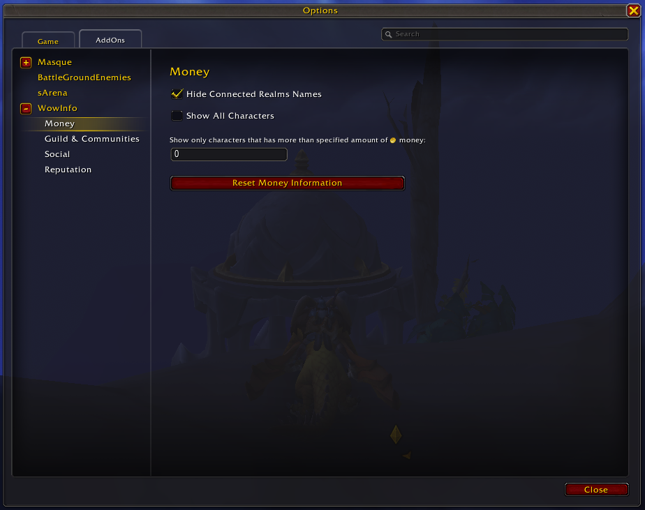

## Character Info Tooltip

Hover over the `Character Info` button to view essential character details:

* Currency for the current expansion.
* Great Vault progress.
* Durability of equipped items and items that exist in the bags.
* Reputation status for tracked factions. You can select the factions in the options.

  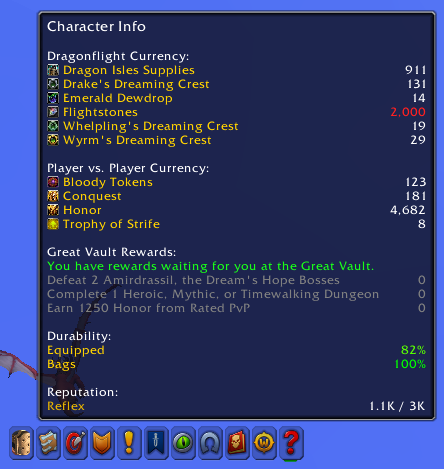

## Spellbook Tooltip

Hover over the `Spellbook` button to see a summary of your professions.

## Achievements Tooltip

Hover over the `Achievements` button for a summary of player and guild achievements.

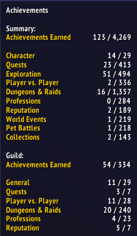

## Quest Log Tooltip

Hover over the `Quest Log` button to see:

* Summary of completed, incomplete, and total quests.
* Campaign and zone story progress.

  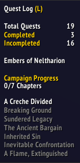

## Guild & Communities Tooltip

Hover over the `Guild & Communities` button to view online guild friends.

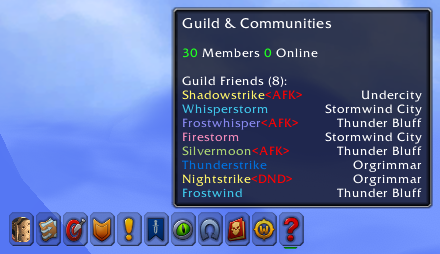

## Group Finder Tooltip

Hover over the `Group Finder` button for:

* Progress of saved dungeons and raids.
* Honor level, conquest bar, and current arena/RBG rating.

  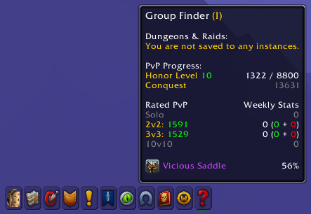

## Adventure's Guide Tooltip

Hover over the `Adventure's Guide` button for a summary of the traveler's log progress and current month's reward.

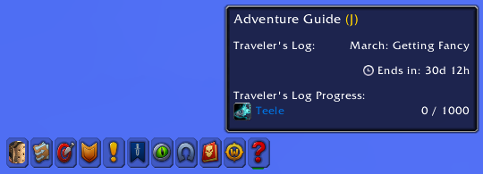

## Collections Tooltip

Hover over the `Collections` button to see total mounts, pets, toys, and respective collect achievements progress.

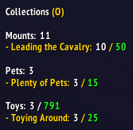

## Game Menu Tooltip

Hover over the `Game Menu` button to view connected realms information.

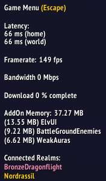

## Backpack Tooltip

Hover over the `Backpack` bag to see the total money for all characters.

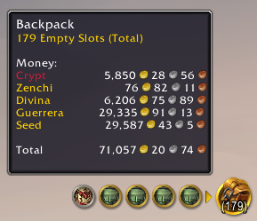

## Clock Tooltip

Hover over the `Clock` to see the reset time for daily quests.

## Status Bar Tooltip

Hover over the `Status Bar` / `Experience Bar` to view extended information on experience progress.

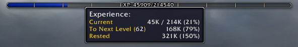

## Social Tooltip

Hover over `Social` to see friends' status (online, AFK, or DND).

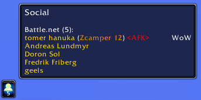

## Currency Tab

Hover over a currency token in the `Currency Tab` to see the amount for characters that have it available.

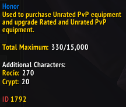

## Minimap

Displays player speed and status on the `Minimap` zone text when the character moves.

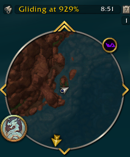

# Side Notes

* Features that track data on multiple characters require logging in and out once for each character for the addon to display it.
* Feedback is always welcome.

### Enjoy!
